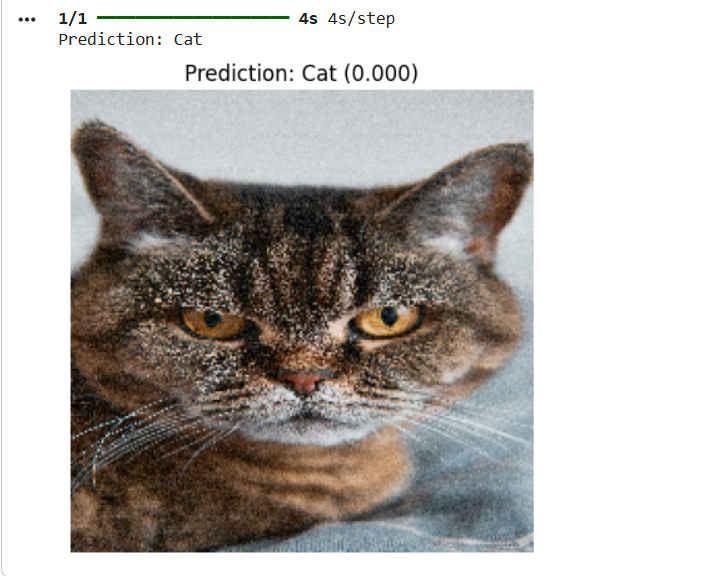

# 🐱🐶 Cat vs Dog Image Classification

A deep learning model for classifying images of **Cats** and **Dogs** using **Transfer Learning** with **ResNet50**.

Built with TensorFlow/Keras and trained on the Kaggle Cat vs Dog dataset.

---

## 📋 Project Overview

- **Model**: ResNet50 (pre-trained on ImageNet) + Custom Head
- **Task**: Binary Image Classification (Cat vs Dog)
- **Framework**: TensorFlow 2.x + Keras
- **Input Image Size**: 224 × 224
- **Dataset**: [Cat or Dog Image Classification](https://www.kaggle.com/datasets/sunilthite/cat-or-dog-image-classification)

## ✨ Features

- Transfer Learning using ResNet50
- Data Augmentation (rotation, shift, zoom, horizontal flip)
- Proper preprocessing with `preprocess_input`
- Global Average Pooling + Dense layers
- Trained on Google Colab with GPU (T4)

## 📊 Dataset Details

- **Training Images**: 23,650
- **Validation/Test Images**: 3,863
- **Classes**: Cat (0), Dog (1)
  
**Dataset Structure:**
  dataset/
├── Train/
│   ├── Cat/
│   └── Dog/
└── Test/
├── Cat/
└── Dog/

## 📸 Application Screenshots

### 📊 Prediction Output



## 🛠️ Technologies Used

- Python 3
- TensorFlow / Keras
- ResNet50 (ImageNet weights)
- ImageDataGenerator
- Google Colab (GPU)

## 📈 Model Architecture

- **Base Model**: ResNet50 (weights='imagenet', trainable=False)
- **Top Layers**:
  - GlobalAveragePooling2D
  - Dense(128, activation='relu')
  - Dense(1, activation='sigmoid')

## 🧪 How to Run the Project

1. Clone the repository:
   ```bash
   git clone https://github.com/yourusername/cat-dog-classification.git
   cd cat-dog-classification

2. Open Cat_Dog_Classification.ipynb in Google Colab
3. Upload your kaggle.json file (Kaggle API key) in the first cell
4. Run all cells

## 👨‍💻 Author

**Karunesh Bansal**

📧 **Email:** karuneshbansal53@gmail.com  

💼 **LinkedIn:**  
[https://www.linkedin.com/in/karunesh-bansal](https://www.linkedin.com/in/karunesh-bansal)

## 🔮 Future Improvements

Fine-tuning the ResNet50 base model
Experiment with EfficientNet / MobileNetV2
Add Learning Rate Scheduler & Early Stopping
Model deployment using TensorFlow Lite / Flask / FastAPI
Create a web app for real-time prediction

## ⭐ Support
If you like this project, give it a ⭐ on GitHub!
